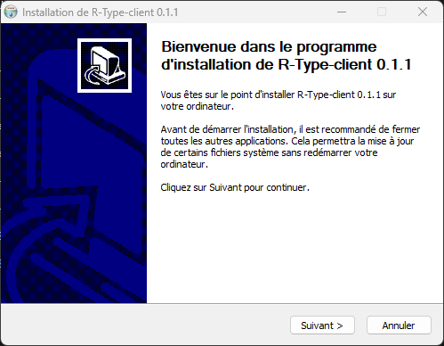
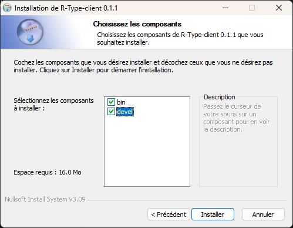

# R-Type

[](https://github.com/Dwozy/R-Type/releases)
[](https://dwozy.github.io/R-Type/)
[](https://github.com/Dwozy/R-Type/actions/workflows/Tests.yml)

R-type is a multiplayer 2D shoot'em up game. The game is separated in two part: the client that display the game to the user, and the server who handle connections and running the game.

This repository contains the game R-type, the server program for R-Type, the Game Engine and a sample platformer game.

# Exchange protocol

The R-Type client and server respect a protocol detailed [here](docs/Protocol.md)

For any creation of new clients or server programs, the protocol must be respected otherwise it will not be compatible.

# Game engine

The R-Type Game Engine is the game engine used to build the R-Type client and server program. It is composed of a static library and headers files. You can use the game engine to create a variety of games.

To use the game engine, refer to [this documentation](docs/GameEngine.md) or the [reference](https://dwozy.github.io/R-Type/namespaceGameEngine.html).

# Downloading
There is two ways to get each part of the game:

## Get the release
Go to the latest release, you can download the archieve or an installer for each part of R-Type (client, server, game engine or sample game) depending on your platform.

### On Linux

#### Archive
Extract the archive, you will find the program in the main folder.

### Script
First you'll need to add execution permission to the installation script (ending in `.sh`) this way:
```bash
chmod +x [script].sh
```

The you can execute the script like this:
```bash
`./[script].sh
```

You'll find a new folder with the part your wanted inside, the program will directly be inside.

### On Windows

#### Archive
Extract the archive, you will find the program in the main folder.

#### Installer
Launch the installer and follow the instructions.


Later select the components (bin is mandatory)


## Build from source

### On Linux

**Requirements**:
 - freetype
 - x11
 - xrandr
 - udev
 - opengl
 - flac
 - ogg
 - vorbis
 - vorbisenc
 - vorbisfile
 - openal
 - pthread
 - cmake
 - a make program
 - a C++ compiler

You should have this installed beforehand.

To build from source, you'll have to download the source code from either a release or in the `Code` menu on the repository Github page.

Then you'll have to go the folder and execute the `build.sh` script like this:
```bash
./build.sh [-d] [part to build]
```

This command without specifying the part to build will build all the parts of R-Type (the game engine, the client, the server, the sample game and the unit tests), the parts to precise are the following:
 - Client
 - Server
 - GameEngine
 - Platformer (for the sample game)
 - tests

You can build all of the part at once by specifiying no part.
Additionally, you can build in debug mode by specifiying `-d` after `./build.sh`

You'll then have the corresponding binary/library in the R-Type folder for the client, the R-Type-server folder for the server, the Platformer folder for the sample platformer game, the GameEngine/GameEngine/lib folder for the game engine and tests folder for the unit tests.

### On Windows

**Requiremants**:
 - cmake
 - a C++ compiler

You should have this installed beforehand.

To build from source, you'll have to download the source code from either a release or in the `Code` menu on the repository Github page.

Then you'll have to go the folder and execute the `build.bat` script by double-clicking on it.

You can also run the `build.bat` script through the Windows cmd like this:
```bash
cmd /c build.bat [-d] [part to build]
```

Simply double-clicking on the script or running the command without specifying the part to build will build all the parts of R-Type (the game engine, the client, the server, the sample game and the unit tests), the parts to precise are the following:
 - Client
 - Server
 - GameEngine
 - Platformer (for the sample game)
 - tests


You can build all of the part at once by specifiying no part.
Additionally, you can build in debug mode by specifiying `-d` after `build.bat`

You'll then have the corresponding binary/library in the R-Type folder for the client, the R-Type-server folder for the server, the Platformer folder for the sample platformer game, the GameEngine\GameEngine\lib folder for the game engine and tests folder for the unit tests.

# Usage
**Important**: Always run the executable alongside the .dll files on windows. For Linux, you should may have to edit the `LD_LIBRARY_PATH` environment variable with the emplacement of the `.so` files or as is if you're building from source.
One thing to keep in mind is that the server represent **one game, when the game is over (Win or Lose), the server must be restarted**.

## Linux
### Server
```bash
./r-type_server [port (default: 8080)]
```
### Client
You should always run from a folder containing the `R-Type/assets`, `R-Type/fonts` and `config` folders (with the required files inside).
```bash
./r-type_client [ip (default: 127.0.0.1)] [port (default: 8080)]
```

### Platformer
You should always run from a folder containing the `Platformer/assets`, `Platformer/maps` and `Platformer/config` folders (with the required files inside).
```bash
./platformer
```

## Windows
### Server
```cmd
.\r-type_server.exe [port (default: 8080)]
```
You can also double clicking on the executable, however you'll only use the default parameters this way.
### Client
You should always run from a folder containing the `R-Type\assets`, `R-Type\fonts` and `config` folders (with the required files inside).
```cmd
./r-type_client.exe [ip (default: 127.0.0.1)] [port (default: 8080)]
```
You can also double clicking on the executable, however you'll only use the default parameters this way.

### Platformer
You should always run from a folder containing the `Platformer\assets`, `Platformer\maps` and `Platformer\config` folders (with the required files inside).
```bash
./platformer
```
You can also double clicking on the executable, however you'll only use the default parameters this way.

# How to play

[Click here](./docs/How%20to%20play.md) to see how to play R-Type or SCP adventure

# Credits

R-Type music by **Aldric Jourdain** and **Damien Pham** (SNO!).
SCP-Adventure music by **Aldric Jourdain** (originally from Shadowy Light).
